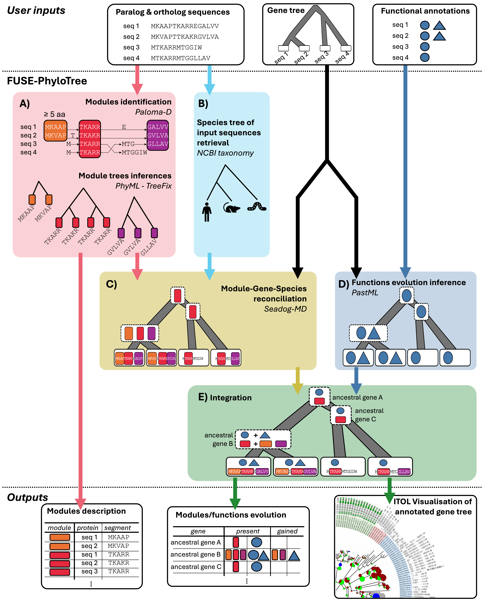
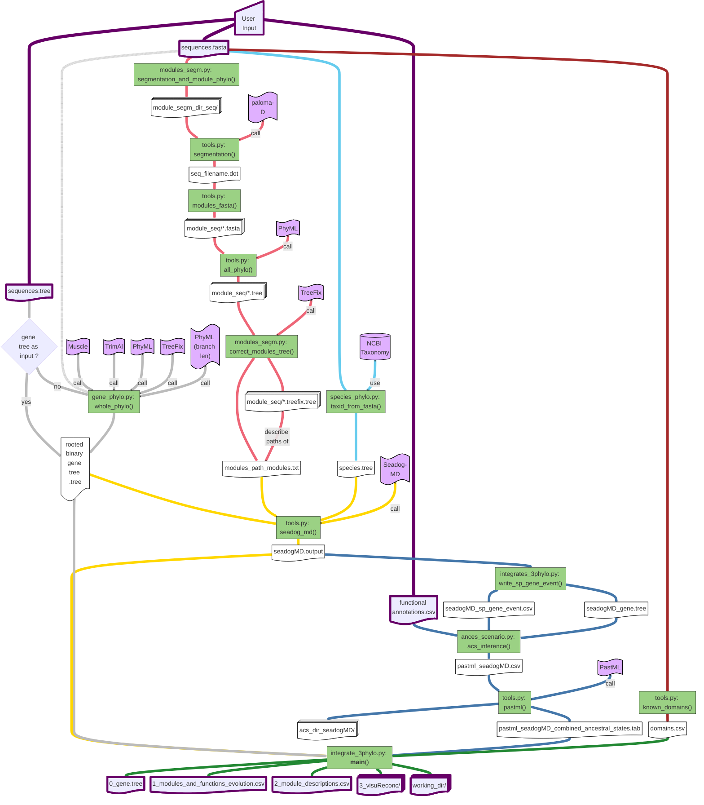

# FUSE-PhyloTree
*FUSE-PhyloTree enables to identify sequence conservation modules and associate them with functional annotations through phylogenomic analysis.*

## Phylogenetic Prediction of Functional Sequence Modules

Introducing an original approach to characterizing functional motifs. This methodology encompasses:
1. Detection of conserved sequence modules (using Partial Local Multiple Alignment)
2. Phylogenetic inference of species/genes/modules/functions evolutionary histories
3. Identification of co-appearances of modules and functions

The process considers protein sequences and their associated functional annotations as input. It then returns the presence of the conserved sequence modules and of the functional annotations in each ancestral gene along the gene phylogeny.




<details><summary><strong>Detailed Pipeline</strong></summary>

Detailed flowchart of the pipeline:


<a href="img/detailed-pipeline.pdf" target="_blank">Detailed pipeline as a PDF</a>


<details><summary><weak>Legend of the detailed pipeline</weak></summary>


</details>
</details>

> ❓ **Differences from PhyloCharMod:** FUSE-PhyloTree is an actively maintained fork of [PhyloCharMod](https://github.com/OcMalde/PhyloCharMod_publ), originally developed for studying the ADAMTS-TSL protein family.

## :books: Citation

*Application note in preparation*

For a more detailed explanation of the methodology, refer to the following article [[Dennler et al. 2023]](https://journals.plos.org/ploscompbiol/article?id=10.1371/journal.pcbi.1011404), or the following PhD thesis (only [available in French](https://www.theses.fr/2022REN1B079)).

# :gear: Simple Usage

To run the full pipeline, simply use: 
```
python3 fuse-phylotree.py <sequences.fasta> <annotations.csv> <gene_tree.tree>
```

>To install and run this command, you need a proper environment. We strongly recommend using the available [Docker](https://github.com/OcMalde/fuse-phylotree/tree/main?tab=readme-ov-file#-docker-image-usage) image (recommended for personal computers) or [Singularity](https://github.com/OcMalde/fuse-phylotree/tree/main?tab=readme-ov-file#-singularity-image-usage) image (recommended for high-performance computing clusters).

## Input 
1. ```<sequences.fasta>```:
   
    Each sequence header must satisfies the format: ```>SeqID_taxid```, where ```SeqID``` represents the unique sequence identifier and ```taxid``` is the NCBI species taxid (e.g., ```>NP031426.2_10090```)

    ```fasta
    >NP00001.1_9913
    MKAAPTKARREGALVV
    >XP00002.1_9606
    MKVAPTTKAKRGVLVA
    >NP00003.1_7955
    MTKARRMTGGIW
    >NP00004.3_9606
    MTKARRMTGGLLAV
    ```
   
    Refer to [this file](https://github.com/OcMalde/fuse-phylotree/blob/main/data/analyse_fibulin/run_singularity_fibulin/fibulin_59.fasta) for an example
   
    Please refrain from using special characters in the header (e.g.```, |,()`":;```). Use only ```_``` as a separator.

   >These files can be generated using orthogroups and GFF files, all of which are included in the Docker and Singularity images for nine species (*Homo sapiens, Mus musculus, Bos taurus, Gallus gallus, Xenopus tropicalis, Danio rerio, Ciona intestinalis, Drosophila melanogaster, Caenorhabditis elegans*). You only need to provide a file with a list of RefSeq of interest. For detailed instructions, please refer to [To build a sequence dataset based on orthogroups](https://github.com/OcMalde/fuse-phylotree/tree/main?tab=readme-ov-file#to-build-a-sequence-dataset-based-on-orthogroups).


2. ```<annotations.csv>```:

   This file contains the functional annotations associated with the different sequences (e.g., PPI)

   Each line should be formatted as: ```SeqID,Annotation_1|Annotation_2```. Here, ```SeqID``` is the unique sequence identifier. It is separated from the list of annotations by a comma (```,```), and individual annotations are separated by pipe symbols (```|```) (e.g., ```NP_620594.1,P00451_F8|P04275_VWF```). Annotations must have more than one character in length.

    ```csv
    NP_00001.1,Interact_with_A|Interact_with_B
    XP_00002.1,Interact_with_A|Interact_with_B
    NP_00003.1,Interact_with_A
    NP_00004.3,Interact_with_A    
    ```

   Refer to [this file](https://github.com/OcMalde/fuse-phylotree/blob/main/data/analyse_fibulin/run_singularity_fibulin/ppi_shared.csv) for an example


3. ```<gene_tree.tree>```:

   This file contains a binary rooted gene tree of the sequences in newick format.

   ```newick
    ((NP_00001.1:0.16,XP_00002.1:0.23):0.87,(NP_00003.1:0.35,NP_00004.3:0.42):0.47);
    ```

   Refer to [this file](https://github.com/OcMalde/fuse-phylotree/blob/main/data/analyse_fibulin/run_singularity_fibulin/fibulin_tree_root.tree) for an example


<details><summary><strong>:bulb: For other option</strong></summary>

>Pre-computed phylogenetic trees or/and paloma module decompositions can be use, as long as they respect the required header format. 

```
usage: fuse-phylotree.py [-h] [--output_directory OUTPUT_DIRECTORY] [--species_tree SPECIES_TREE] [--infer_gene_tree INFER_GENE_TREE] [--plma_file PLMA_FILE] [--reconc_domains] multi_fasta_file leaf_functions_csv [gene_tree]

positional arguments:
  multi_fasta_file      Multi fasta file, with specific formated header >RefSeq_taxid (ex : >XP_012810820.2_8364)
  leaf_functions_csv    csv file containing for each of our sequence, the list of his functions (ex : XP_012810820.2, P59509 | P999999)
  gene_tree             Gene tree to use as a support for the pastML and DGS reconciliation inference (WARNING, must correspond to the sequences in the multi fasta file !)

optional arguments:
  -h, --help            show this help message and exit
  --output_directory OUTPUT_DIRECTORY
                        output directory name
  --species_tree SPECIES_TREE
                        Species tree to use as a support for the reconciliations (WARNING, must correspond to the taxid use in the other files !)
  --infer_gene_tree INFER_GENE_TREE
                        Infer gene tree to use as a support for the pastML and DGS reconciliation inference (WARNING, user should check it and reroot it - we advise to only use it if you know what you are doing !)
  --plma_file PLMA_FILE
                        Paloma-2 output file (.agraph format, .dot, or .oplma format)
  --reconc_domains      Do a DGS reconciliation with known modules (pfam / prosite)
```

>**:warning: Infering the gene tree using the pipeline option ```--infer_gene_tree```** When running the analysis without a gene tree as input (with ```--infer_gene_tree```), a default rooted tree will be generated. However, for optimal results, **it is strongly recommended to infer a properly rooted gene tree prior to analysis and use it as the input for the gene_tree option**. The gene phylogenetic tree serves as a critical template for the entire analysis, thus it is essential that a reliable and accurately rooted gene tree is prepared and utilized.

</details>

## Output
The main workflow output is the list of modules and functions that are present, gained or lost at the different ancestral genes. This output is presented as a table in the file ```1_modules_and_functions_evolution.csv``` (Example [here](https://github.com/OcMalde/fuse-phylotree/blob/main/data/analyse_fibulin/run_singularity_fibulin/1_modules_and_functions_evolution.csv)). It is strongly advised to also look at the final gene tree (with internal node names) ```0_gene.tree``` to visualise the annotated gene nodes. The file ```0_gene.tree``` corresponds to the input phylogenetic tree and assigns an ancestor name  to each internal node. The description of all the modules is available in ```2_module_descriptions.csv``` and it enables to get module segments (sequences and positions) based on module names. For an interactive visualisation of these data, various iTOL files are generated in ```3_visuReconc/``` and compressed in ```3_visuReconc.zip``` for batch upload on iTOL.

0. ```0_gene.tree```:

      This file contains the binary rooted gene tree of the sequences in newick format with internal node names.

1. ```1_modules_and_functions_evolution.csv```:

      This file contains the list of modules and functions that are present, gained or lost at the different ancestral and actual genes, i.e., for all nodes in the gene tree.

2. ```2_module_descriptions.csv```:

      This file contains all module descriptions: all their segments, proteins, and positions in the protein sequences.

3. ```3_visuReconc/```:

      This directory contains various iTOL files for the interactive visualisation.

<details><summary><strong>Working directory</strong></summary>

The intermediates outputs obtained at each of the pipeline steps are provided in a directory called ```working_dir_*``` (see [this directory](https://github.com/OcMalde/fuse-phylotree/tree/main/data/analyse_fibulin/run_singularity_fibulin) for an example)
```
working_directory
├── 0_gene.tree										-----> file contains the binary rooted gene tree of the sequences in newick format with internal node names
├── 1_modules_and_functions_evolution.csv						-----> file contains the list of modules/functions present/gained/lost at the different ancestral and actual genes, i.e., for all nodes in the gene tree
├── 2_module_descriptions.csv								-----> file contains all module descriptions: all their segments, proteins, and positions in the protein sequences
├── 3_visuReconc									-----> All itol visualisation files
│   ├── geneReconc_seadogMD_*.tree							-----> The "final" gene tree after treefix correction / internal node labelling by seadog mDGS reconciliation / branch length computing by PhyML
│   ├── itolAnnotPresence_seadogMD_*.txt						-----> Annotation presences in leaves as heatmap
│   ├── itolBarModulesNb_seadogMD_*.txt							-----> Module number in leaves as barplot
│   ├── itolDomains_seadogMD_*.txt							-----> Domain decompositions as domain mosaics
│   ├── itolGOt_seadogMD_*.txt								-----> Annotation presence as symbols
│   ├── itolModPresence_seadogMD_*.txt							-----> Module presences in leaves as heatmap
│   ├── itolModTransfer_seadogMD_*.txt							-----> Module transfers as arrows
│   ├── itol_modules_PieGainsLost_seadogMD_*.txt					-----> Number of modules gained / lost at each gene nodes as a pie charts
│   ├── itolModulesPresent_G*_*_*_only_mod.txt						-----> For each gene node * : all module segments in actual gene present at this * (ancestral) gene as domain mosaics (brown squares)
│   ├── itolModules_seadogMD_*.txt							-----> Module decompositions as domain mosaics
│   ├── itolModulesThatChanged_G*_*_*_only_mod.txt					-----> For each gene node * : all module segments in actual gene gained at this * (ancestral) gene as domain mosaics (green squares)
│   ├── itolPopup_seadogMD_*.txt							-----> Gene nodes popup with module and annotation decriptions
│   ├── itol_ppi_PieGainsLost_seadogMD_*.txt						-----> Number of modules gained / lost at each gene nodes as a pie charts
│   └── itolSpGeneEvents_seadogMD_*.txt							-----> Gene - Species reconcilation events as symbols
├── 3_visuReconc.zip									-----> All itol visualisation files compressed for itol batch upload
└── working_dir_*
    ├── gene.fasta									-----> The input fasta file
    ├── *_species.tree									-----> Species tree extracted from ncbi taxonomy
    ├── leaf_Manual.csv									-----> The input with gene functional annotation file
    ├── gene.tree                                                    			-----> The input gene tree file (if given as input)
    │
    ├── acs_dir_seadogMD_*_gene								-----> All ancestral scenario reconstruction files from pastML
    │   ├── leaf_Manual.csv								-----> The input with gene functional annotation file
    │   ├── pastml_seadogMD_*_gene_leaf_Manual_combined_ancestral_states.tab		-----> pastML output regrouping all annotation ancestral states
    │   ├── pastml_seadogMD_*_gene_leaf_Manual.csv					-----> The input annotation formated as a {0,1,?} matrix for pastML use
    │   ├── seadogMD_*_gene_pastml							-----> pastML outputs
    │   │   ├── marginal_probabilities.character_*.model_*.tab
    │   │   ├── params.character_*.method_MPPA.model_*.tab
    │   ├── seadogMD_*_gene.tree							-----> The "final" gene tree after treefix correction / internal node labelling by seadog mDGS reconciliation / branch length computing by PhyML
    │   └── seadogMD_*_sp_gene_event.csv						-----> Gene nodes event from Species - Gene reconciliation (e.g., Gene duplication, Speciation)
    │
    ├── gene_phylo_dir_*								-----> All tree construction files
    │   ├── gene.fasta									-----> The input fasta file
    │   ├── gene.tree									-----> The "final" gene tree after treefix correction / internal node labelling by seadog mDGS reconciliation / branch length computing by PhyML
    │   ├── *_species.tree								-----> Species tree extracted from ncbi taxonomy
    │   ├── muscle_*.fasta								-----> Alignment file from muscle  
    │   ├── phyml_trimal_muscle_*.tree							-----> Tree generated by PhyML after alignment with MUSCLE and filtration with trimAl
    │   ├── phyml_trimal_muscle_*_treefix_dir						-----> Directory containing TreeFix tree correction files
    │   │   ├── phyml_trimal_muscle_*.fasta						-----> Sequence alignment used for tree correction
    │   │   ├── phyml_trimal_muscle_*.tree						-----> Initial tree generated by PhyML before correction
    │   │   └── phyml_trimal_muscle_*.treefix.tree					-----> Tree corrected after treatment with TreeFix
    │   ├── phyml_trimal_muscle_*_treefix_dir.smap					-----> Node correspondence file between initial tree and corrected tree
    │   ├── phyml_trimal_muscle_*_treefix_dir_treeToFixPath.txt				-----> Path of the file containing the tree to be corrected
    │   ├── trimal_muscle_*.fasta							-----> Sequence alignment after filtration with trimAl
    │   ├── trimal_muscle_*.phylip							-----> Phylip file containing filtered alignment
    │   ├── trimal_muscle_*.phylip_phyml_stats.txt					-----> Phylogenetic model statistics used by PhyML
    │   └── trimal_muscle_*.phylip_phyml_tree.txt					-----> Phylogenetic tree generated by PhyML from Phylip alignment
    │
    ├── gene_tree_*
    │   └── gene.tree									-----> The "final" gene tree after treefix correction / internal node labelling by seadog mDGS reconciliation / branch length computing by PhyML
    │
    ├── modulesChange_seadogMD_*.csv							-----> Lists of modules gained / lost at each gene nodes
    ├── modulesCompo_seadogMD_*.csv							-----> Lists of modules presents at each gene nodes
    ├── modules_paths_modules_*_t*m*M*.txt						-----> Define list of module trees to use as seadog input
    ├── modules_segm_dir_*								-----> All modules decomposition files: paloma plma -> for all modules: module fasta -> PhyML tree -> treefix corrected tree
    │   ├── *.dnd
    │   ├── *.fasta
    │   ├── *_t*m*M*.dot								-----> The plma file (from input or computed by paloma)
    │   ├── *_t*m*M*.oplma
    │   ├── *_t*m*M*.plma
    │   ├── *_t*m*M*_q*.agraph								-----> The plma file (from input or computed by paloma)
    │   ├── *_t*M*.afc
    │   ├── *.weights
    │   └── modules_*_t*m*M*
    │       ├── B*.fasta								-----> A module fasta file
    │       ├── B*.phylip								-----> A module in phylip format
    │       ├── B*.phylip_phyml_stats.txt						-----> PhyML output
    │       ├── B*.phylip_phyml_tree.txt						-----> PhyML output
    │       ├── B*.tree									-----> PhyML output
    │       ├── B*_treefix_dir								-----> treefix working directory
    │       │   ├── B*.fasta								-----> Module fasta file 
    │       │   ├── B*.tree								-----> Module PhyML tree
    │       │   └── B*.treefix.tree							-----> Module treefix corrected tree - "final"
    │       ├── B*_treefix_dir.smap							-----> Gene - Module nodes mapping
    │       └── B*_treefix_dir_treeToFixPath.txt					-----> Define treefix input
    │
    ├── domains_*.csv									-----> Known domains/motifs from scans
    ├── complete_functionChange_moduleChange_seadogMD_*.csv				-----> Table of all annotations and modules gained / lost at each gene nodes (actual and ancestral)
    ├── functionChange_moduleChange_expand_seadogMD_*.csv				-----> Table of modules gained / lost at each gene nodes where there is annotation changes (actual and ancestral) with all module segment details in leaf
    ├── functionChange_moduleChange_seadogMD_*.csv					-----> Table of modules gained / lost at each gene nodes where there is annotation changes (actual and ancestral)
    ├── seadogMD_*_gene.tree								-----> Gene tree from seadog mDGS, with internal gene labelled
    ├── seadogMD_*.output								-----> Seadog mDGS output file
    ├── seadogMD_*_sp_gene_event.csv							-----> Gene nodes event from Species - Gene reconciliation (e.g., Gene duplication, Speciation)
    └── specieGeneEvent_seadogMD_*.csv							-----> Gene nodes event from Species - Gene reconciliation (e.g., Gene duplication, Speciation)
```
</details>

# 🐳 Docker Image Usage

## Docker Installation
For ease of use, considering the various software and dependencies required, we strongly recommend using our Docker image. 
After installing [Docker](https://www.docker.com/get-started/), you can pull our Docker image using the following command:

```
docker pull ghcr.io/ocmalde/fuse-phylotree:v1.0.0
```

## Run the Docker Image

First, you need to create a container, linked to your workspace, and connect to it interactively:

```
docker run -it --entrypoint /bin/bash -v "$(pwd):/workspace" -w /workspace ghcr.io/ocmalde/fuse-phylotree:v1.0.0
```

Then you can simply execute the whole pipeline using:

```
python3 /fuse-phylotree/fuse-phylotree.py <sequences.fasta> <annotations.csv> <gene_tree.tree>
```
To quit it, simply type ```exit```

Example with test files provided in the Docker image (you need to connect to the container first):
```
cd test_dir/ && python3 ../fuse-phylotree/fuse-phylotree.py --infer_gene_tree INFER_GENE_TREE 712buddy37seq.fasta leaf_Manual_712.csv
```

If you already made a container, you can obtain its ```<CONTAINER ID>``` using ```docker ps -a```.
Using the ```<CONTAINER ID>```, you can connect to the existing container with:
```
docker start <CONTAINER ID> && docker attach <CONTAINER ID>
```

To use move file from/to the container, use:
```
docker cp <CONTAINER ID>:/path/in/container/ /path/in/local
```

# 🌀 Singularity Image Usage

## Singularity Installation
On most High Performance Computing clusters, you can directly pull our Singularity image using the following command:

```
singularity pull fuse-phylotree.sif https://github.com/OcMalde/fuse-phylotree/releases/download/V1.0.0/fuse-phylotree.sif
```

## Run the Singularity Image

```
singularity exec fuse-phylotree.sif python3 /fuse-phylotree/fuse-phylotree.py <sequences.fasta> <annotations.csv> <gene_tree.tree>
```


# Advanced Usage


### To integrate already computed results :

```cd working_dir```

```
python3 /fuse-phylotree/integrate_3phylo.py seadogMD_{input}.output gene_tree_{input}/{input}.tree --pastml_tab acs_dir_seadogMD_{input}_gene/pastml_seadogMD_{input}_gene_leaf_Manual_{input}_combined_ancestral_states.tab --domains_csv domains_{input}.csv
``` 

### To build a sequence dataset based on orthogroups

Using simple lists of RefSeq IDs proteins and a FUSE-PhyloTree Docker or Singularity image, you can easily generate a formatted FASTA file for the pipeline. This file will contain the longest protein sequence for each homolog (both orthologs and paralogs) in your input family. Simply run one of the following script:

- [make_orthogroup_fasta.sh](https://github.com/OcMalde/fuse-phylotree/blob/main/helper-scripts/make_orthogroup_fasta.sh)

```Usage: make_orthogroup_fasta.sh <id_seq_file> <name> <docker_image|singularity_image_path>```

> 📑 ```<id_seq_file>``` example:
```txt
NP_001987.2
NP_006476.2
NP_006477.2
NP_006478.2
...
```

<details><summary><strong>:mag: Step by step</strong></summary>

You can use as input any fasta file with ortholog and paralog sequences, as long as their headers are formatted. But we propose a sequence dataset building based on orthogroups from the [OrthoFinder](https://github.com/davidemms/OrthoFinder) tool. As a prerequisite, you will need to select a set of species (and one assembly per species) and to have: 
- The ```Orthgroup.tsv``` file, computed with OrthoFinder on the proteomes of the selected assemblies of the selected species (to do so, run ```orthofinder -f <directory with all assemblie proteomes in fasta>```).
- A directory containing the description in ```.gff``` of the selected assemblies (e.g., ```GCF_000002035.6.gff```).
- An ```assoc_taxid_spName.csv``` file with taxid and species name associations (e.g., ```7955,Danio rerio```).
- An ```assoc_taxid_assembly.csv``` file with taxid and assembly name associations (e.g., ```7955,GCF_000002035```).
- An ```my_protein.txt``` file with refseq of the proteins of interest to study (one refseq per line). 


To build your own dataset, we propose a methodology for identifying and selecting the longest protein sequence to represent each gene from a list of protein sequences of interest, which may include multiple isoforms' RefSeq IDs for comprehensiveness. Initially, the process involves searching for (pre-computed) orthogroups that contain the provided RefSeq IDs and extracting all associated protein sequences, including orthologs, paralogs, and their various isoforms. Subsequently, each extracted protein sequence undergoes a search for its genomic locus. Proteins are then grouped by gene based on overlapping genomic loci on the same chromosome strand. For each gene (i.e., a group of protein sequences), the longest protein sequence is selected as the representative sequence. The final output consists of these representative sequences as fasta, which are saved to a specified path ```<orthogroup_dir>/isoforms_per_locus/longest_isoform.fasta```, thus offering a comprehensive representation of the protein family of interest.

#### 0. Cluster the proteomes in orthogroups with the ```OrthoFinder```software.

If you are using the Docker image, pre-computed orthogroups and all associated file for 9 species (*7955 - Danio rerio; 9606 - Homo sapiens; 9913 - Bos taurus; 7719 - Ciona intestinalis; 10090 - Mus musculus; 7227 - Drosophila melanogaster; 8364 - Xenopus tropicalis; 6239 - Caenorhabditis elegans; 9031 - Gallus gallus*) are available in the image directory: ```/data_9sp```

> :warning: **The Orthofinder results used human proteom version: GCF_000001405.39**: recent RefSeq may not be retrived (see S1 Table of the article for version of other species assemblies)

#### 1. Select orthogroups with at least one protein of interest, with ```python3 fuse-phylotree/myOrthogroups_fasta.py```.
```
usage: myOrthogroups_fasta.py [-h] [--download] orthogroups_file myProtein_file assocF_taxid_sp

positional arguments:
  orthogroups_file  csv file containing the orthogroups from an orthofinder analysis
  myProtein_file    text file containing the ncbi id of the our protein of interest
  assocF_taxid_sp   association file : taxid, specieName

optional arguments:
  -h, --help        show this help message and exit
  --download        download proteins sequences of all the proteins in our orthogroups of interest
```
With the ```--download``` argument, a fasta directory will be build, containing all sequences of the proteins in the selected orthogroups (i.e., the one containing the proteins of interest).

Example for a file ```<refseqID.txt>``` (simply one refseq ID by line) using pre-computed orthogroups for 9 species: 
```
docker run -w $(pwd) -v $(pwd):$(pwd) --rm ghcr.io/ocmalde/fuse-phylotree:v1.0.0 /fuse-phylotree/myOrthogroups_fasta.py /data_9sp/Orthogroups.tsv <refseqID.txt>  /data_9sp/assocF_taxid_spName.csv --download
```

#### 2. Regroup the protein by gene, based on genomic annotation (gff) and keep only the longest isoform for each gene, with ```python3 fuse-phylotree/gff_regroup_iso_locus.py```.

```
usage: gff_regroup_iso_locus.py [-h] [--fasta_directory FASTA_DIRECTORY] [--assoc_file ASSOC_FILE] [--gff_directory GFF_DIRECTORY]

optional arguments:
  -h, --help            show this help message and exit
  --fasta_directory FASTA_DIRECTORY
                        Directory containing proteins fasta selection files, name in the format selec_taxid.fasta
  --assoc_file ASSOC_FILE
                        .csv association file (taxid, db_name)
  --gff_directory GFF_DIRECTORY
                        Directory containing genome at the gff format (filename must contains db_name of the assoc_file)
```

Example for ```<orthogroup_dir>``` (computed on previous step):
```
docker run -w $(pwd) -v $(pwd):$(pwd) --rm ghcr.io/ocmalde/fuse-phylotree:v1.0.0 python3 /fuse-phylotree/gff_regroup_iso_locus.py --fasta_directory <orthogroup_dir> --assoc_file /data_9sp/assocF_taxid_dbnt.csv --gff_directory /data_9sp/gff
```
The fasta file containing only the longest sequence by gene will be written in ```<orthogroup_dir>/isoforms_per_locus/longest_isoform.fasta``` 

</details>

# Standalone Modules

## Modules
Specific [modules of the pipeline](https://github.com/OcMalde/fuse-phylotree/tree/main/fuse-phylotree) can be executed independently (see their ```--help``` for all usage details).

For example, to compute a phylogenetic tree using Muscle/Trimal/PhyML/Treefix: 
```
python3 /fuse-phylotree/gene_phylo.py <fasta_file> <species_tree>
```
To only compute the final intergration module:
```
python3 /fuse-phylotree/integrate_3phylo.py <seadogMD.output> <gene_tree.tree> --pastml_tab <pastml_seadogMD_combined_ancestral_states.tab> --domains_csv <domains.csv>
```

## Softwares
All the different [included softwares](https://github.com/OcMalde/fuse-phylotree/tree/main#softwares) are usable using the Docker or Singularity image.
For example, paloma-D can be used with:
```
docker start <CONTAINER ID> && docker exec <CONTAINER ID> /bin/bash -c ". ~/.bashrc && paloma-D --help && exit"
``` 
Or simply: ```paloma-D --help``` if connected to a container

```
singularity exec fuse_phylotree.sif paloma-D --help
``` 


# Dependencies

All these programs are mandatory to run *FUSE-PhyloTree*, and must be in ;
```/usr/local/bin/```
If not, their path must be specified in the config file ;
```fuse-phylotree/config.txt```

### Softwares

[Muscle](http://www.drive5.com/muscle/) (v3.8.31), one of the best-performing multiple alignment programs, [Conda package](https://anaconda.org/bioconda/muscle)

[PhyML](https://github.com/stephaneguindon/phyml) (v3.3.20190909), maximum likelihood phylogenetic inference for the gene and the module trees, [Conda package](https://anaconda.org/bioconda/phyml)

[TreeFix](https://www.cs.hmc.edu/~yjw/software/treefix/) (v1.1.10), Statistically Informed Gene Tree Error Correction Using Species Trees, [Conda package](https://anaconda.org/OcMalde/treefix)

[trimAL](https://github.com/inab/trimal) (v1.4.rev15), Alignment filtering, [Conda package](https://anaconda.org/bioconda/trimal) 

[SEADOG-MD](https://compbio.engr.uconn.edu/software/seadog/), for DGS-reconciliation.

[PastML](https://pastml.pasteur.fr/) (v1.9.41), for ancestral characters inference, [Pip package](https://pypi.org/project/pastml/)

[paloma-D](http://tools.genouest.org/tools/protomata/learn/) (v0.1), for sequence segmentation. 

