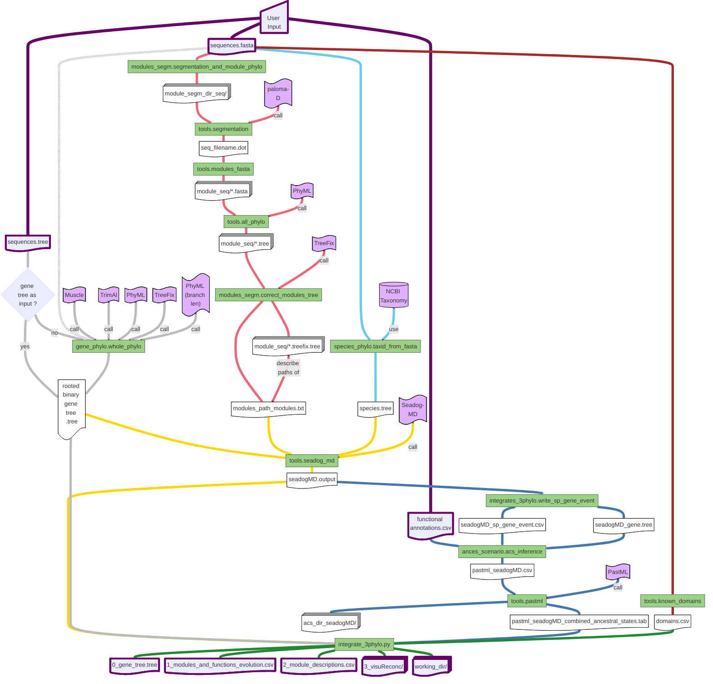

# FUSE-PhyloTree
*FUSE-PhyloTree enables to identify sequence conservation modules and associate them with functional annotations through phylogenomic analysis.*

## Phylogenetic Prediction of Functional Sequence Modules

Introducing an original approach to characterizing functional motifs. This methodology encompasses:
1. Detection of conserved sequence modules (using Partial Local Multiple Alignment)
2. Phylogenetic inference of species/genes/modules/functions evolutionary histories
3. Identification of co-appearances of modules and functions

The process accepts protein sequences and their associated functional annotations as input. It then returns the presence of conserved sequence modules, along with their associated functional annotations, across different ancestral genes.


<details><summary><strong>Detailed Pipeline</strong></summary>

Flowchart of the detailed pipeline:


<a href="img/detailed-pipeline.pdf" target="_blank">Detailed pipeline as a PDF</a>


<details><summary><weak>Legend of the detailed pipeline</weak></summary>


</details>
</details>

## Citation

*Application note in preparation*

For a more detailed explanation of the methodology, refer to the following article [[Dennler et al. 2023]](https://journals.plos.org/ploscompbiol/article?id=10.1371/journal.pcbi.1011404), or the following PhD thesis (only [available in French](https://www.theses.fr/2022REN1B079)).

# Simple Usage
### Docker Installation
For ease of use, considering the various software and dependencies required, we strongly recommend using our Docker image. 
After installing [Docker](https://www.docker.com/get-started/), you can pull our Docker image using the following command:

```
docker pull ghcr.io/ocmalde/fuse-phylotree:1.0
```

### Run the Docker Image

First, you need to make a container and connect interactivly to it:

```
docker run -it --entrypoint /bin/bash ghcr.io/ocmalde/fuse-phylotree:1.0 
```

Then you can simply execute the whole pipeline using:

```
python3 /fuse-phylotree/fuse-phylotree.py <sequences.fasta> <annotations.csv>
```
To quit it, simply type ```exit```

Example with test files provided in the Docker image (you need to connect to the container first):
```
cd test_dir/ && python3 ../fuse-phylotree/fuse-phylotree.py 712buddy37seq.fasta leaf_Manual_712.csv
```

If you already made a container, you can obtain its ```<CONTAINER ID>``` using ```docker ps -a```.
Using the ```<CONTAINER ID>```, you can connect to the existing container with:
```
docker start <CONTAINER ID> && docker attach <CONTAINER ID>
```

To use move file from/to the container, use:
```
docker cp <CONTAINER ID>:/path/in/container/ /path/in/local
```


## Input 
1. ```<sequences.fasta>```:
   
    Each sequence header must adhere to the format: ```>SeqID_taxid```, where ```SeqID``` represents the unique sequence identifier and ```taxid``` is the NCBI species taxid (e.g., ```>NP031426.2_10090```)
   
    Refer to [this file](https://github.com/OcMalde/PhyloCharMod_publ/blob/main/data/min5_human_214_t10m1M20/214.fasta) for an example
   
    Please refrain from using special characters in the header (e.g.```, |,()`":;```). Use only ```_``` as a separator.

   These files can be generated using orthogroups and GFF files, all of which are included in the Docker image for the nine species. You only need to compile a file with a list of RefSeq of interest. For detailed instructions, please refer to [To-build-a-sequence-dataset-based-on-orthogroups](https://github.com/OcMalde/PhyloCharMod_publ/tree/main#to-build-a-sequence-dataset-based-on-orthogroups).

2. ```<annotations.csv>```:

   This file contains the functional annotations associated with the different sequences (e.g., PPI)

   Each line should be formatted as: ```SeqID,Annotation_1|Annotation_2```. Here, ```SeqID``` is the unique sequence identifier. It's separated from the list of annotations by a comma (```,```), and individual annotations are separated by a pipe (```|```) (e.g., ```NP_620594.1,P00451_F8|P04275_VWF```). Annotations must be more than one character in length.

   Refer to [this file](https://github.com/OcMalde/PhyloCharMod_publ/blob/main/data/min5_human_214_t10m1M20/leaf_Manual_214.csv) for an example


3. ```<gene_tree.tree>```:

   This file contains a binary rooted gene tree of the sequences in newick format.

  <details><summary><weak>Infering the gene tree using the pipeline...</weak></summary>
  > :warning: **Important Notice: Default Execution and Gene Tree Input.** When running the analysis without a gene tree as input (with ```--infer_gene_tree```), a default rooted tree will be generated. However, for optimal results, **it is strongly recommended to infer a properly rooted gene tree prior to analysis and use it as the input for the gene_tree option**. The gene phylogenetic tree serves as a critical template for the entire analysis, thus it is essential that a reliable and accurately rooted gene tree is prepared and utilized.
  </details>

<details><summary><weak>Pre-computed phylogenetic trees or/and paloma module decompositions can be use, as long as they respect the required header format (see ```python3 fuse-phylotree/fuse-phylotree.py --help``` for details)</weak></summary>
```
usage: fuse-phylotree.py [-h] [--output_directory OUTPUT_DIRECTORY] [--species_tree SPECIES_TREE] [--gene_tree GENE_TREE] [--plma_file PLMA_FILE] [--reconc_domains] multi_fasta_file leaf_functions_csv

positional arguments:
  multi_fasta_file      Multi fasta file, with specific formated header >RefSeq_taxid (ex : >XP_012810820.2_8364)
  leaf_functions_csv    csv file containing for each of our sequence, the list of his functions (ex : XP_012810820.2, P59509 | P999999)

optional arguments:
  -h, --help            show this help message and exit
  --output_directory OUTPUT_DIRECTORY
                        output directory name
  --species_tree SPECIES_TREE
                        Species tree to use as a support for the reconciliations (WARNING, must correspond to the taxid use in the other files !)
  --gene_tree GENE_TREE
                        Gene tree to use as a support for the pastML and DGS reconciliation inference (WARNING, must correspond to the sequences in the multi fasta file !)
  --plma_file PLMA_FILE
                        Paloma-D output file (.agraph format, .dot, or .oplma format)
  --reconc_domains      Do a DGS reconciliation with known modules (pfam / prosite)
```
</details>

## Output
The main workflow output is the list of modules/functions present/gained/lost at the different ancestral genes. This output is presented as a table in the file ```1_modules_and_functions_evolution.csv``` (Example [here](https://github.com/OcMalde/PhyloCharMod_publ/blob/main/data/min5_human_214_t10m1M20/complete_functionChange_moduleChange_seadogMD_214.csv)). It is strongly advised to also look at the the final gene tree (with internal node names) ```0_gene_tree.tree``` to visualise the annotated gene nodes. Plus, description of all modules are available in ```2_module_descriptions.csv``` and enable to get module segments (sequences and positions) based on module names.

For an interactive visualisation of these data, various iTOL files are generated in ```3_visuReconc/``` and compressed in ```3_visuReconc.zip``` for batch upload on iTOL.

<details><summary><strong>Working directory</strong></summary>

For all details, all outputs and working files will be available such as (see [this directory](https://github.com/OcMalde/PhyloCharMod_publ/tree/main/data/min5_human_214_t10m1M20) for an example)
```
working_dir
│ 
├── gene.fasta                                                    -----> The input fasta file
├── leaf_Manual.csv                                               -----> The input with gene functional annotation file
├── gene.tree                                                     -----> The input gene tree file (if given as input)
├── t*m*M*_plma.dot                                               -----> The input plma file (if given as input)
│
├── acs_dir                                                       -----> All ancestral scenario reconstruction files from pastML
│   ├── results_pastml                                            -----> pastML outputs
│   │   ├── marginal_probabilities.character_*
│   │   ├── params.character_*
│   ├── leaf.csv                                                  -----> The input annotation file
│   ├── pastml.csv                                                -----> The input annotation formated as a {0,1,?} matrix for pastML use
│   ├── pastml_combined_ancestral_states.tab                      -----> pastML output regrouping all annotation ancestral states
│   ├── seadog_gene.tree                                          -----> The "final" gene tree after treefix correction / internal node labelling by seadog mDGS reconciliation / branch length computing by PhyML
│   └── seadog_sp_gene_event.csv                                  -----> Gene nodes event from Species - Gene reconciliation (e.g., Gene duplication, Speciation)
│
├── gene_tree
│   └── gene.tree                                                 -----> The "final" gene tree after treefix correction / internal node labelling by seadog mDGS reconciliation / branch length computing by PhyML
│
├── modules_segm_dir                                              -----> All modules decomposition files: paloma plma -> for all modules: module fasta -> PhyML tree -> treefix corrected tree
│   ├── modules_t*m*M*_plma
│   │   ├── B*.fasta                                              -----> A module fasta file
│   │   ├── B*.phylip                                             -----> A module in phylip format
│   │   ├── B*.phylip_phyml_stats.txt                             -----> PhyML output
│   │   ├── B*.phylip_phyml_tree.txt                              -----> PhyML output
│   │   ├── B*.tree                                               -----> PhyML output
│   │   ├── B*_treefix_dir.smap                                   -----> Gene - Module nodes mapping
│   │   ├── B*_treefix_dir_treeToFixPath.txt                      -----> Define treefix input
│   │   ├── B*_treefix_dir                                        -----> treefix working directory
│   │   │   ├── B*.fasta                                          -----> Module fasta file 
│   │   │   ├── B*.tree                                           -----> Module PhyML tree
│   │   │   ├── B*.treefix.tree                                   -----> Module treefix corrected tree - "final"
│   ├── gene.fasta                                                -----> The input fasta file
│   └── t*m*M*_plma.dot (or t*m*M*_plma.agraph)                   -----> The plma file (from input or computed by paloma)
│
├── modules_paths_modules_t*m*M*_plma.txt                         -----> Define list of module trees to use as seadog input
├── seadog.output                                                 -----> Seadog mDGS output file
├── seadog_gene.tree                                              -----> Gene tree from seadog mDGS, with internal gene labelled
├── seadog_sp_gene_event.csv (or specieGeneEvent_seadog.csv)      -----> Gene nodes event from Species - Gene reconciliation (e.g., Gene duplication, Speciation)
│
├── visuReconc                                                    -----> All itol visualisation files
│   ├── geneReconc_seadog.tree                                    -----> The "final" gene tree after treefix correction / internal node labelling by seadog mDGS reconciliation / branch length computing by PhyML
│   ├── itolAnnotPresence.txt                                     -----> Annotation presences in leaves as heatmap
│   ├── itolModPresence.txt                                       -----> Module presences in leaves as heatmap
│   ├── itolBarModulesNb.txt                                      -----> Module number in leaves as barplot
│   ├── itolDomains.txt                                           -----> Domain decompositions as domain mosaics
│   ├── itolGOt.txt                                               -----> Annotation presence as symbols
│   ├── itolModTransfer.txt                                       -----> Module transfers as arrows
│   ├── itolModulesPresent_G*_*_*_only_mod.txt                    -----> For each gene node * : all module segments in actual gene present at this * (ancestral) gene as domain mosaics (brown squares)
│   ├── itolModulesThatChanged_G*_*_*_only_mod.txt                -----> For each gene node * : all module segments in actual gene gained at this * (ancestral) gene as domain mosaics (green squares)
│   ├── itolModules.txt                                           -----> Module decompositions as domain mosaics
│   ├── itolPopup.txt                                             -----> Gene nodes popup with module and annotation decriptions
│   ├── itolSpGeneEvents.txt                                      -----> Gene - Species reconcilation events as symbols
│   ├── itol_modules_PieGainsLost.txt                             -----> Number of modules gained / lost at each gene nodes as a pie charts
│   └── itol_ppi_PieGainsLost.txt                                 -----> Number of modules gained / lost at each gene nodes as a pie charts
├── visuReconc.zip                                                -----> All itol visualisation files compressed for itol batch upload
│
├── species.tree                                                  -----> Species tree extracted from ncbi taxonomy
├── domains.csv                                                   -----> Known domains/motifs from scans
│
├── modulesCompo.csv                                              -----> Lists of modules presents at each gene nodes
├── modulesChange.csv                                             -----> Lists of modules gained / lost at each gene nodes
│
├── complete_functionChange_moduleChange.csv                      -----> Table of all annotations and modules gained / lost at each gene nodes (actual and ancestral)
├── ances_functionChange_moduleChange.csv                         -----> Table of all annotations and modules gained / lost at each gene nodes (only ancestral)
├── ances_modulesChange.csv                                       -----> Table of modules gained / lost at each gene nodes (only ancestral)
│
├── functionChange_moduleChange.csv                               -----> Table of modules gained / lost at each gene nodes where there is annotation changes (actual and ancestral)
├── functionChange_moduleChange_expand.csv                        -----> Table of modules gained / lost at each gene nodes where there is annotation changes (actual and ancestral) with all module segment details in leaf
└── onlyAnc_functionChange_moduleChange_expand.csv                -----> Table of modules gained / lost at each gene nodes where there is annotation changes (only ancestral) with all module segment details in leaf


```
</details>


## Advanced Usage


### To integrate already computed results :

```cd working_dir```

```
python3 /fuse-phylotree/integrate_3phylo.py seadogMD_{input}.output gene_tree_{input}/{input}.tree --pastml_tab acs_dir_seadogMD_{input}_gene/pastml_seadogMD_{input}_gene_leaf_Manual_{input}_combined_ancestral_states.tab --domains_csv domains_{input}.csv
``` 

### To build a sequence dataset based on orthogroups

You can use as input any fasta file with ortholog and paralog sequences, as long as their headers are formatted. But we propose a sequence dataset building based on orthogroups from the [OrthoFinder](https://github.com/davidemms/OrthoFinder) tool. As a prerequisite, you will need to select a set of species (and one assembly per species) and to have: 
- The ```Orthgroup.tsv``` file, computed with OrthoFinder on the proteomes of the selected assemblies of the selected species (to do so, run ```orthofinder -f <directory with all assemblie proteomes in fasta>```).
- A directory containing the description in ```.gff``` of the selected assemblies (e.g., ```GCF_000002035.6.gff```).
- An ```assoc_taxid_spName.csv``` file with taxid and species name associations (e.g., ```7955,Danio rerio```).
- An ```assoc_taxid_assembly.csv``` file with taxid and assembly name associations (e.g., ```7955,GCF_000002035```).
- An ```my_protein.txt``` file with refseq of the proteins of interest to study (one refseq per line). 


To build your own dataset, we propose a methodology for identifying and selecting the longest protein sequence to represent each gene from a list of protein sequences of interest, which may include multiple isoforms' RefSeq IDs for comprehensiveness. Initially, the process involves searching for (pre-computed) orthogroups that contain the provided RefSeq IDs and extracting all associated protein sequences, including orthologs, paralogs, and their various isoforms. Subsequently, each extracted protein sequence undergoes a search for its genomic locus. Proteins are then grouped by gene based on overlapping genomic loci on the same chromosome strand. For each gene (i.e., a group of protein sequences), the longest protein sequence is selected as the representative sequence. The final output consists of these representative sequences as fasta, which are saved to a specified path ```<orthogroup_dir>/isoforms_per_locus/longest_isoform.fasta```, thus offering a comprehensive representation of the protein family of interest.

#### 0. Cluster the proteomes in orthogroups with the ```OrthoFinder```software.

If you are using the Docker image, pre-computed orthogroups and all associated file for 9 species (*7955 - Danio rerio; 9606 - Homo sapiens; 9913 - Bos taurus; 7719 - Ciona intestinalis; 10090 - Mus musculus; 7227 - Drosophila melanogaster; 8364 - Xenopus tropicalis; 6239 - Caenorhabditis elegans; 9031 - Gallus gallus*) are available in the image directory: ```/data_9sp```

> :warning: **The Orthofinder results used human proteom version: GCF_000001405.39**: recent RefSeq may not be retrived (see S1 Table of the article for version of other species assemblies)

#### 1. Select orthogroups with at least one protein of interest, with ```python3 fuse-phylotree/myOrthogroups_fasta.py```.
```
usage: myOrthogroups_fasta.py [-h] [--download] orthogroups_file myProtein_file assocF_taxid_sp

positional arguments:
  orthogroups_file  csv file containing the orthogroups from an orthofinder analysis
  myProtein_file    text file containing the ncbi id of the our protein of interest
  assocF_taxid_sp   association file : taxid, specieName

optional arguments:
  -h, --help        show this help message and exit
  --download        download proteins sequences of all the proteins in our orthogroups of interest
```
With the ```--download``` argument, a fasta directory will be build, containing all sequences of the proteins in the selected orthogroups (i.e., the one containing the proteins of interest).

Example for a file ```<refseqID.txt>``` (simply one refseq ID by line) using pre-computed orthogroups for 9 species: 
```
docker run -w $(pwd) -v $(pwd):$(pwd) --rm ghcr.io/ocmalde/fuse-phylotree:1.0 /fuse-phylotree/myOrthogroups_fasta.py /data_9sp/Orthogroups.tsv <refseqID.txt>  /data_9sp/assocF_taxid_spName.csv --download
```

#### 2. Regroup the protein by gene, based on genomic annotation (gff) and keep only the longest isoform for each gene, with ```python3 fuse-phylotree/gff_regroup_iso_locus.py```.

```
usage: gff_regroup_iso_locus.py [-h] [--fasta_directory FASTA_DIRECTORY] [--assoc_file ASSOC_FILE] [--gff_directory GFF_DIRECTORY]

optional arguments:
  -h, --help            show this help message and exit
  --fasta_directory FASTA_DIRECTORY
                        Directory containing proteins fasta selection files, name in the format selec_taxid.fasta
  --assoc_file ASSOC_FILE
                        .csv association file (taxid, db_name)
  --gff_directory GFF_DIRECTORY
                        Directory containing genome at the gff format (filename must contains db_name of the assoc_file)
```

Example for ```<orthogroup_dir>``` (computed on previous step):
```
docker run -w $(pwd) -v $(pwd):$(pwd) --rm ghcr.io/ocmalde/fuse-phylotree:1.0 python3 /fuse-phylotree/gff_regroup_iso_locus.py --fasta_directory <orthogroup_dir> --assoc_file /data_9sp/assocF_taxid_dbnt.csv --gff_directory /data_9sp/gff
```
The fasta file containing only the longest sequence by gene will be written in ```<orthogroup_dir>/isoforms_per_locus/longest_isoform.fasta``` 

## Standalone Modules

### Modules
Specific [modules of the pipeline](https://github.com/OcMalde/fuse-phylotree/tree/main/fusephylotree) can be executed independently (see their ```--help``` for all usage details).

For example, to compute a phylogenetic tree using Muscle/Trimal/PhyML/Treefix: 
```
python3 /fuse-phylotree/gene_phylo.py <fasta_file> <species_tree>
```
To only compute the final intergration module:
```
python3 /fuse-phylotree/integrate_3phylo.py <seadogMD.output> <gene_tree.tree> --pastml_tab <pastml_seadogMD_combined_ancestral_states.tab> --domains_csv <domains.csv>
```

### Softwares
All the different [included softwares](https://github.com/OcMalde/fuse-phylotree/tree/main#softwares) are usable using the Docker image.
For example, paloma-D can be used with:
```
docker start <CONTAINER ID> && docker exec <CONTAINER ID> /bin/bash -c ". ~/.bashrc && paloma-D --help && exit"
``` 
Or simply: ```paloma-D --help``` if connected to a container


## Dependencies

All these programs are mandatory to run *FUSE-PhyloTree*, and must be in ;
```/usr/local/bin/```
If not, their path must be specified in the config file ;
```fuse-phylotree/config.txt```

#### Softwares

[Muscle](http://www.drive5.com/muscle/) (v3.8.31), one of the best-performing multiple alignment programs, [Conda package](https://anaconda.org/bioconda/muscle)

[PhyML](https://github.com/stephaneguindon/phyml) (v3.3.20190909), maximum likelihood phylogenetic inference for the gene and the module trees, [Conda package](https://anaconda.org/bioconda/phyml)

[TreeFix](https://www.cs.hmc.edu/~yjw/software/treefix/) (v1.1.10), Statistically Informed Gene Tree Error Correction Using Species Trees, [Conda package](https://anaconda.org/OcMalde/treefix)

[SEADOG-MD](https://compbio.engr.uconn.edu/software/seadog/), for DGS-reconciliation.

[PastML](https://pastml.pasteur.fr/) (v1.9.33), for ancestral characters inference, [Pip package](https://pypi.org/project/pastml/)

[paloma-D](http://tools.genouest.org/tools/protomata/learn/) (v0.1), for sequence segmentation. 

